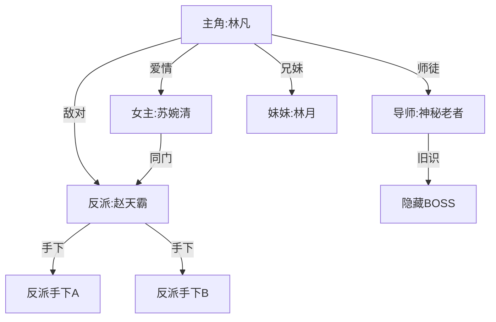
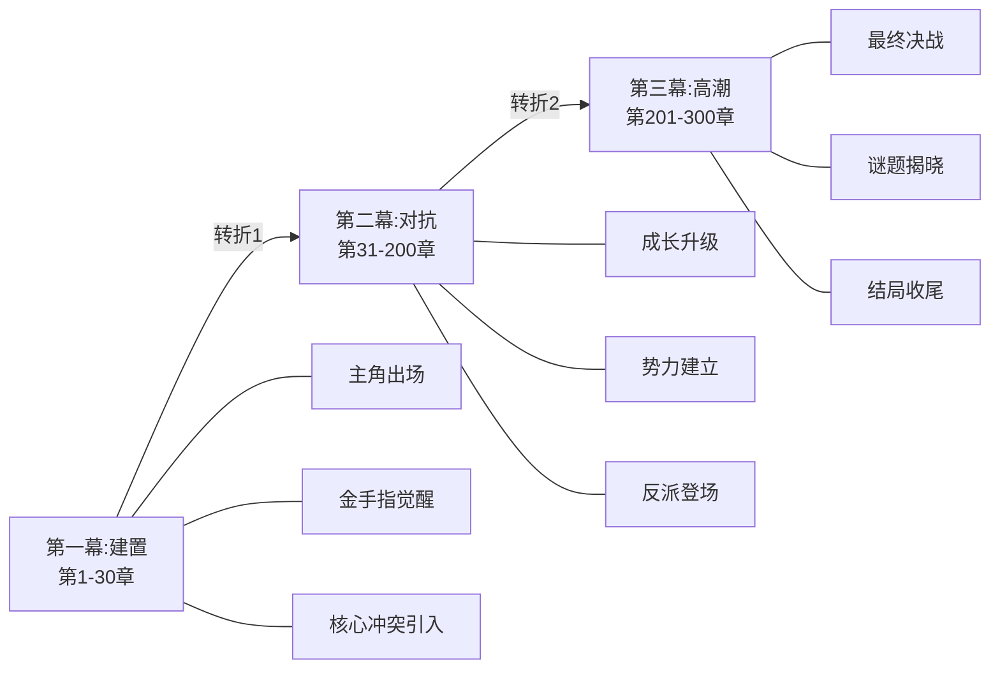
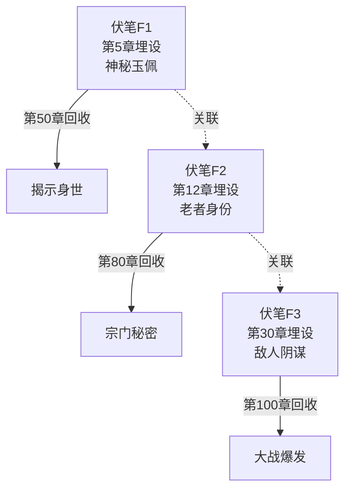
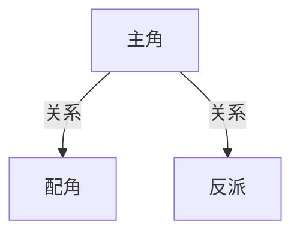
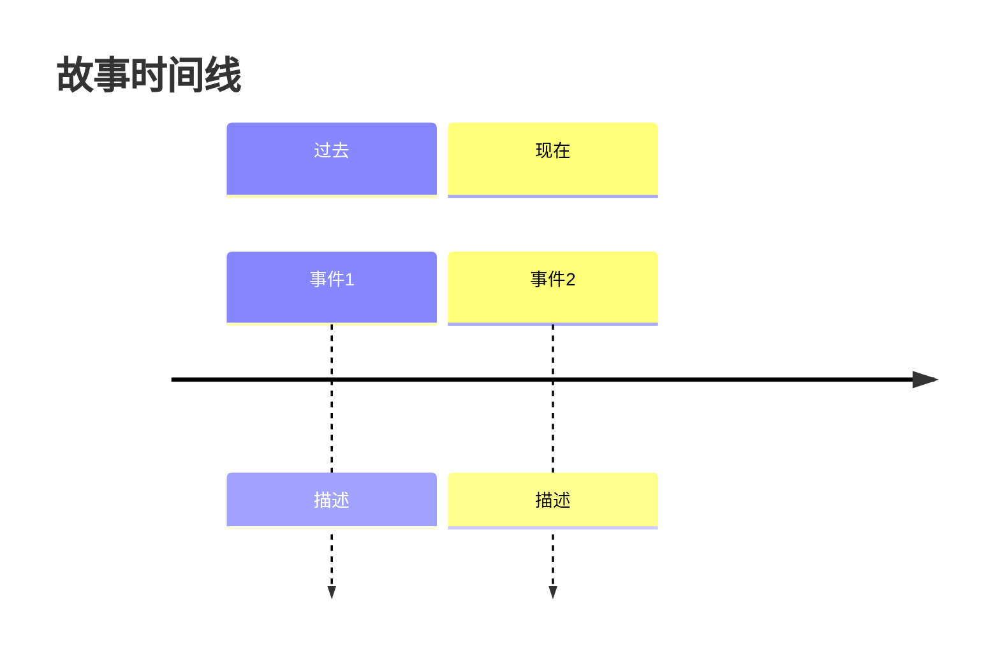

# 共享模块：自动化可视化工具

> **按需加载**：涉及数据可视化、图表生成、关系图谱时加载
> **全局规则**：遵循主控文件第二章核心铁律
> **版本**：v21.1

---

## 一、系统概述

自动化可视化工具用于根据小说创作数据自动生成各类可视化图表，包括人物关系图、情节结构图、节奏曲线图等，帮助作者更直观地理解和把控创作全局。

**核心目标**：
- 自动生成可视化图表
- 降低使用门槛
- 实时更新数据
- 支持多种导出格式

---

## 二、可视化类型

### 2.1 人物关系图

#### 自动生成流程

```
读取大纲文件
    ↓
提取人物信息
    ↓
识别关系类型
    ↓
生成关系图谱
    ↓
输出Mermaid代码
    ↓
可选：导出为图片
```

#### 关系图类型

**类型1：层级关系图**


**类型2：关系矩阵图**

| 人物 | 林凡 | 苏婉清 | 赵天霸 | 林月 | 神秘老者 |
|------|:---:|:---:|:---:|:---:|:---:|
| **林凡** | - | 爱情 | 敌对 | 兄妹 | 师徒 |
| **苏婉清** | 爱情 | - | 同门 | 友好 | 陌生 |
| **赵天霸** | 敌对 | 同门 | - | 敌对 | 敌对 |
| **林月** | 兄妹 | 友好 | 敌对 | - | 陌生 |
| **神秘老者** | 师徒 | 陌生 | 敌对 | 陌生 | - |

**类型3：关系变化时间线**
```
第1章    林凡 → 苏婉清: 陌生人
    ↓
第10章   林凡 → 苏婉清: 同门
    ↓
第30章   林凡 → 苏婉清: 好感
    ↓
第50章   林凡 → 苏婉清: 爱情
```

#### 触发方式

| 指令 | 功能 |
|------|------|
| `生成关系图` | 生成完整人物关系图 |
| `关系图 [人物名]` | 生成以指定人物为中心的关系图 |
| `关系变化图` | 生成关系变化时间线 |

### 2.2 情节结构图

#### 三幕式结构可视化



#### 爽点分布图

```
爽点强度
   │
10 ┤                              ★高潮
   │                         ★
 8 ┤                    ★
   │               ★
 6 ┤          ★
   │     ★
 4 ┤★
   │
 2 ┤
   │
 0 ┼────┬────┬────┬────┬────┬────┬────┬────┬────┬────→ 章节
   0    10   20   30   40   50   60   70   80   90  100

★ = 爽点位置
```

#### 情绪曲线图

```
情绪强度
    ^
 10│         高潮
   │      ╭╮╱
  8│   ╭╮╱  ╰╮
  6│╭╮╱      ╰╮    ╭╮
  4│╯          ╰╮╭╯╰╮
  2│             ╯   ╰
   └──────────────────────→ 章节
     1   10   20   30   40   50

情绪类型: 爽=红色, 虐=蓝色, 悬疑=紫色, 燃=橙色
```

### 2.3 伏笔追踪图

#### 伏笔网络图



#### 伏笔状态表

| 编号 | 埋设章节 | 内容 | 计划回收 | 状态 | 倒计时 |
|------|---------|------|---------|------|:------:|
| F001 | 第5章 | 神秘玉佩 | 第50章 | 🟡 待回收 | 5章 |
| F002 | 第12章 | 老者身份 | 第80章 | 🟢 正常 | 30章 |
| F003 | 第30章 | 敌人阴谋 | 第100章 | 🟢 正常 | 40章 |
| F004 | 第45章 | 隐藏势力 | 第60章 | 🔴 超期 | -10章 |

### 2.4 创作进度仪表盘

```markdown
## 创作进度仪表盘

### 整体进度
```
总进度: 35% [████████░░░░░░░░░░░░]

卷一: 100% [████████████████████] ✅ 已完成
卷二: 50%  [██████████░░░░░░░░░░] ⚙️ 进行中
卷三: 0%   [░░░░░░░░░░░░░░░░░░░░] ⏸️ 未开始
```

### 关键指标
| 指标 | 当前 | 目标 | 状态 |
|------|:---:|:---:|:----:|
| 总字数 | 35万字 | 100万字 | 🟡 正常 |
| 平均章长 | 2800字 | 3000字 | 🟢 达标 |
| 爽点密度 | 0.45/章 | 0.5/章 | 🟡 接近 |
| 钩子强度 | 7.2/10 | 7/10 | 🟢 达标 |

### 预警
⚠️ 伏笔F004已超期10章，建议尽快回收
```

---

## 三、自动触发机制

### 3.1 触发条件

| 触发时机 | 生成图表 | 说明 |
|---------|---------|------|
| **大纲完成后** | 人物关系图、情节结构图 | 自动生成 |
| **每10章完成** | 爽点分布图、情绪曲线图 | 自动生成 |
| **每50章完成** | 完整仪表盘、伏笔追踪图 | 自动生成 |
| **用户请求** | 指定图表 | 手动触发 |

### 3.2 自动更新

```
新章节生成
    ↓
更新数据
    ↓
触发相关图表更新
    ↓
增量更新（仅更新变化部分）
    ↓
保存新版本
```

---

## 四、导出格式

### 4.1 支持格式

| 格式 | 用途 | 特点 |
|------|------|------|
| **Mermaid** | 在线编辑 | 可修改，支持实时预览 |
| **PNG** | 分享展示 | 高清图片，适合社交媒体 |
| **PDF** | 存档打印 | 矢量图形，可打印 |
| **SVG** | 网页嵌入 | 矢量图形，可缩放 |
| **Markdown** | 文档集成 | 文本格式，易编辑 |

### 4.2 导出指令

| 指令 | 功能 |
|------|------|
| `导出关系图 [格式]` | 导出人物关系图 |
| `导出结构图 [格式]` | 导出情节结构图 |
| `导出曲线图 [格式]` | 导出节奏曲线图 |
| `导出仪表盘 [格式]` | 导出完整仪表盘 |
| `导出全部 [格式]` | 导出所有图表 |

---

## 五、集成到写作流程

### 5.1 与模式B集成（大纲阶段）

```markdown
### 大纲完成后的自动生成

1. 读取大纲文件
2. 提取人物信息
3. 生成人物关系图
4. 生成情节结构图
5. 显示可视化预览
6. 提供导出选项
```

### 5.2 与模式C集成（正文阶段）

```markdown
### 每10章自动生成

1. 统计最近10章数据
2. 更新爽点分布图
3. 更新情绪曲线图
4. 更新伏笔状态图
5. 显示更新后的图表
```

### 5.3 与模式E集成（诊断阶段）

```markdown
### 诊断报告可视化

1. 生成质量指标雷达图
2. 生成问题分布图
3. 生成改进趋势图
4. 嵌入诊断报告
```

---

## 六、版本历史

| 版本 | 日期 | 变更内容 |
|------|------|---------|
| v21.1 | 2026-06 | 初始版本，建立自动化可视化工具 |

---

## 附录：快速参考

### 可视化指令速查

| 指令 | 功能 |
|------|------|
| `关系图` | 生成人物关系图 |
| `结构图` | 生成情节结构图 |
| `爽点图` | 生成爽点分布图 |
| `情绪图` | 生成情绪曲线图 |
| `伏笔图` | 生成伏笔追踪图 |
| `仪表盘` | 显示创作仪表盘 |
| `导出 [格式]` | 导出图表 |

### Mermaid语法示例

**人物关系图**：


**时间线**：


**流程图**：

