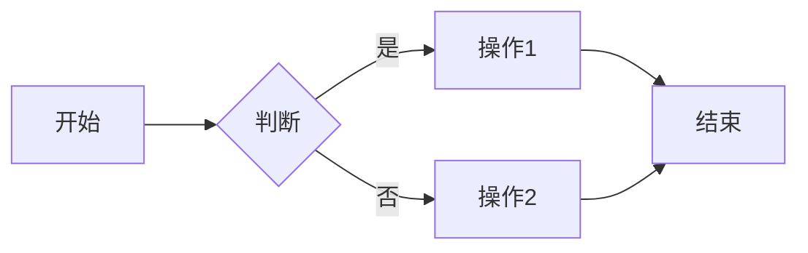

# 占位符与格式规范

> **版本**：v21.2
> **适用范围**：所有模式文件、模板、文档

---

## 1. 占位符规范

### 1.1 占位符类型

| 类型 | 格式 | 示例 | 说明 |
|------|------|------|------|
| **必填项** | `<占位符>` | `<书名>`、`<章节号>` | 用户必须提供的内容 |
| **选填项** | `[占位符]` | `[别名]`、`[可选描述]` | 用户可选择提供的内容 |
| **示例值** | `{示例值}` | `{玄幻}`、`{30章}` | 仅用于说明可能取值 |

### 1.2 占位符命名规则

```markdown
# 正确的命名方式
<书名>
<章节号>
<字数范围>
<情绪基调>

# 错误的命名方式（使用方括号）
[书名]     ❌
[章节号]   ❌
```

### 1.3 占位符使用示例

```markdown
## 正确的格式

### 大纲生成
- 书名：<书名>
- 题材：<玄幻/仙侠/都市/科幻>
- 章节数：<100-200>
- 字数：<50万字>
- 核心梗：<一句话概括卖点>

## 错误的格式

### 大纲生成
- 书名：[书名]       ❌
- 题材：{玄幻}       ❌
- 章节数：100-200    ❌ 缺少占位符标记
```

---

## 2. Markdown格式规范

### 2.1 标题层级

```markdown
# 模式A：灵感构思          ← 一级标题：模式名称
## 灵感收集流程           ← 二级标题：模块名称
### 步骤一：题材选择      ← 三级标题：子模块
#### 题材类型             ← 四级标题：具体功能
```

### 2.2 代码块标记

```markdown
# 使用 ```markdown 标记代码块语言
```markdown
## 示例标题
内容...
```

# 使用 ``` 表示行内代码
输入 `大纲` 开始生成
```

### 2.3 表格格式

```markdown
| 表头1 | 表头2 | 表头3 |
|-------|-------|-------|
| 内容1 | 内容2 | 内容3 |
| 内容4 | 内容5 | 内容6 |
```

### 2.4 列表格式

```markdown
# 无序列表
- 项目一
- 项目二
  - 子项目（缩进2空格）
  - 子项目

# 有序列表
1. 第一步
2. 第二步
3. 第三步
```

---

## 3. Emoji使用规范

### 3.1 Emoji分类

| 类别 | Emoji | 用途 |
|------|-------|------|
| **状态类** | ✅ ❌ ⚠️ 🔴 🟠 🟡 🟢 | 操作结果、成功/失败状态 |
| **信息类** | 📖 📊 🎯 💡 ⭐ ⏱️ 📝 | 内容类型、信息标注 |
| **操作类** | 🎲 🎴 🔍 ⏏️ 📋 ➡️ | 用户操作、流程引导 |
| **情绪类** | 😄 😢 😠 😱 🤩 😏 | 情绪表达、角色情感 |
| **场景类** | 🏠 🌆 🌙 ☀️ 🌧️ ❄️ | 场景描写、环境设定 |

### 3.2 Emoji使用示例

```markdown
## 正确的使用方式

### 状态提示
✅ 创作完成
❌ 保存失败
⚠️ 内容偏离

### 信息标注
📖 章节概览
📊 数据统计
🎯 核心目标

## 过度使用（不推荐）
😀 主角😀很开心😄地😁跑过来🤩
```

---

## 4. 流程图规范

### 4.1 流程图标记

```markdown

```

### 4.2 流程符号

| 符号 | 类型 | 说明 |
|------|------|------|
| `[ ]` | 矩形 | 操作/步骤 |
| `{ }` | 菱形 | 判断/条件 |
| `( )` | 圆角矩形 | 开始/结束 |
| `--> ` | 箭头 | 流程方向 |

---

## 5. 文件命名规范

### 5.1 模式文件命名

```markdown
# 标准格式
mode-<字母>-<功能名>.md

# 正确示例
mode-a-inspiration.md
mode-b-outline.md
mode-b2-detailed-outline.md
mode-c-writing.md
mode-e-diagnostics.md

# 子模块命名
mode-e/
├── inspiration-collision.md
├── outline-plot-deep-diagnosis.md
└── ...
```

### 5.2 脚本文件命名

```markdown
# Python脚本：snake_case.py
save_outline.py
check_chapter_wordcount.py
file_manager.py

# 测试文件：test_<模块名>.py
test_file_save.py
```

---

## 6. 版本标记规范

```markdown
# 放置在文件开头
> **版本**：v21.2
> **更新时间**：2024-01-15
> **维护者**：[姓名]
> **触发词**：`指令1`、`指令2`、`指令3`

# 版本变更记录
## v21.2 (2024-01-15)
- 新增章节内高潮检测功能
- 补充字数预估字段

## v21.1 (2024-01-10)
- 强化细纲约束传递
```

---

## 7. 检错清单

编辑文件时，请检查：

- [ ] 占位符是否使用 `<>` 而非 `[]` 或 `{}`
- [ ] 标题层级是否正确（一级# → 二级## → 三级###）
- [ ] 表格格式是否规范（表头与内容对齐）
- [ ] 代码块是否标注语言（```markdown）
- [ ] Emoji是否过度使用
- [ ] 列表缩进是否一致（2空格）
- [ ] 版本号是否更新
