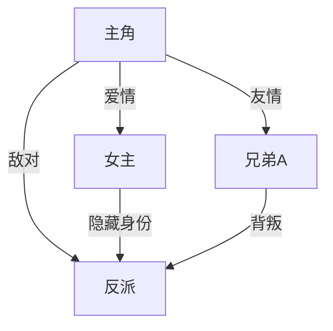
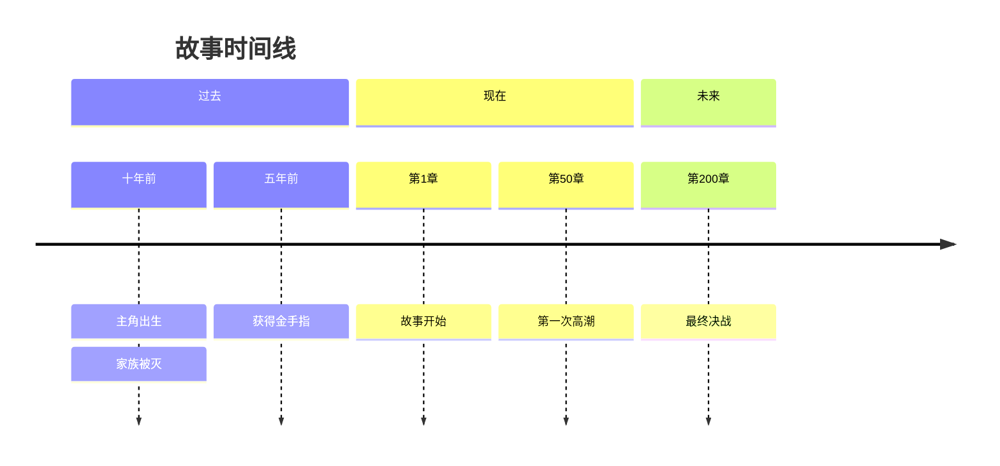
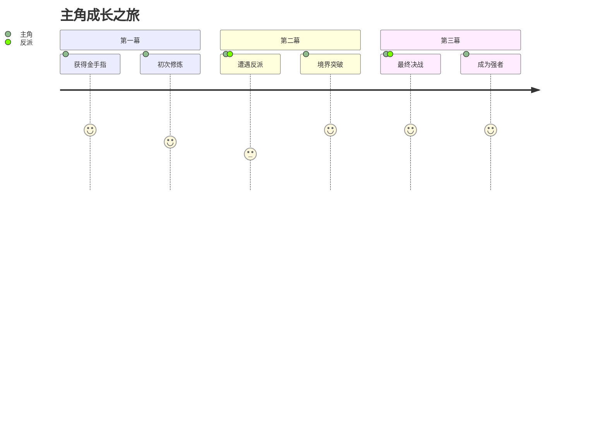
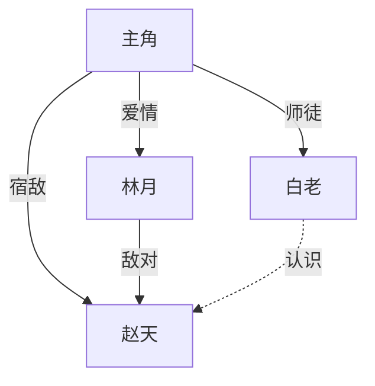
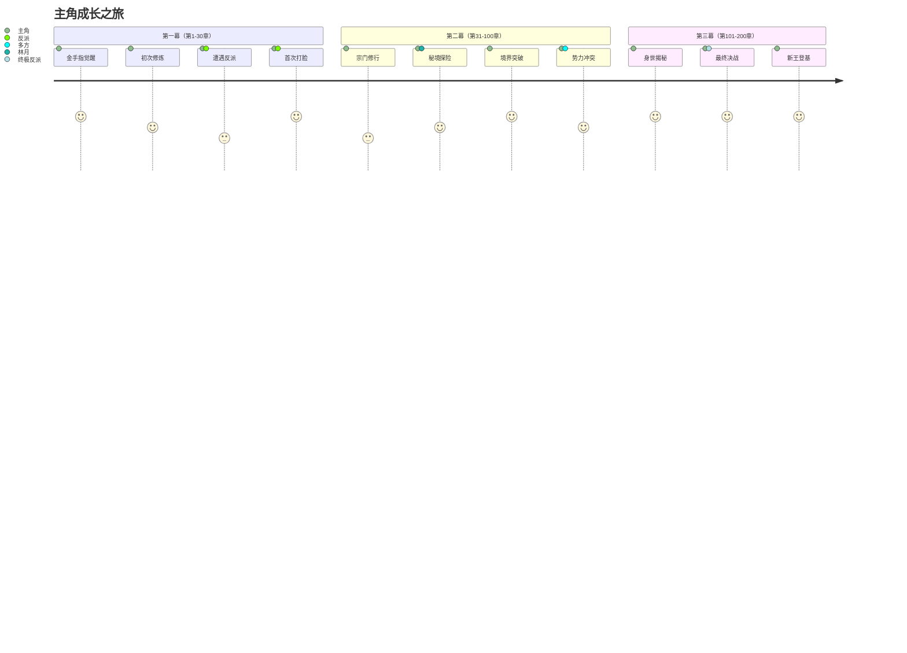
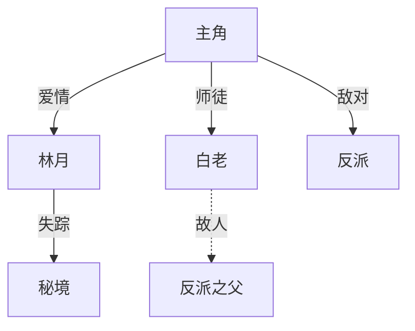

# 共享模块：可视化辅助工具指南

> 按需加载：当用户需要可视化展示创作内容时，如人物关系图、时间线、情节结构图等。
> 全局规则：遵循主控文件第二章核心铁律

---

## 一、工具概述

本模块提供一系列可视化工具的使用指南，帮助作者更直观地理解和展示创作内容。

**适用场景**：
- 人物关系复杂，需要梳理关系网
- 时间线跨度大，需要理清事件顺序
- 情节结构复杂，需要可视化展示
- 向他人展示创作构思

**工具类型**：
- 人物关系图
- 时间线
- 情节结构图
- 爽点分布图
- 情绪曲线图

---

## 二、人物关系图

### 2.1 使用场景
- 人物数量≥5人
- 人物之间存在复杂关系（亲情、爱情、敌对、利益等）
- 需要梳理人物之间的隐藏联系

### 2.2 绘制方法

**方法一：文本层级图（推荐）**
```
主角
├── 爱情线
│   ├── 女主（表面：敌对 → 实际：相爱）
│   └── 女配（暗恋主角，后期黑化）
├── 亲情线
│   ├── 父亲（失踪，后期揭示为反派BOSS）
│   └── 养母（牺牲，推动主角成长）
├── 友情线
│   ├── 兄弟A（忠诚，但身份可疑）
│   └── 兄弟B（表面忠诚，实际背叛）
└── 敌对线
    ├── 反派A（前期BOSS，被主角击败）
    ├── 反派B（中期BOSS，与主角有血缘关系）
    └── 终极BOSS（主角父亲，理念冲突）
```

**方法二：表格矩阵**

| 角色 | 与主角关系 | 关系类型 | 关系变化 | 隐藏秘密 |
|------|-----------|---------|---------|---------|
| 女主 | 从敌对到相爱 | 爱情 | 第50章和解，第100章确认关系 | 真实身份是敌对势力公主 |
| 父亲 | 从失踪到敌对 | 亲情→敌对 | 第200章揭示为BOSS | 当年抛弃主角有苦衷 |
| 兄弟B | 从忠诚到背叛 | 友情→背叛 | 第150章背叛 | 被反派收买 |

### 2.3 关系类型标识

| 符号 | 含义 | 示例 |
|------|------|------|
| ─── | 直接关系 | 父子、夫妻 |
| - - - | 间接关系 | 通过第三方联系 |
| → | 单向影响 | A影响B |
| ⇄ | 双向影响 | A和B互相影响 |
| ⊕ | 隐藏关系 | 表面无关，实际有关 |
| ⊗ | 冲突关系 | 敌对、竞争 |

---

## 三、时间线

### 3.1 使用场景
- 故事时间跨度大（≥10年）
- 有倒叙、插叙等复杂时间结构
- 需要理清事件因果关系

### 3.2 绘制方法

**水平时间线**
```
十年前 ────── 五年前 ────── 三年前 ────── 现在 ────── 三年后
   │            │            │           │           │
   ▼            ▼            ▼           ▼           ▼
主角出生    家族被灭    获得金手指    故事开始    最终决战
   │            │            │           │           │
   └────────────┴────────────┘           └───────────┘
         背景故事                          主线故事
```

**垂直时间线（章节版）**
```
第1章    主角出场，金手指觉醒
  │
  ▼
第10章   第一次境界突破
  │
  ▼
第30章   击败第一个反派
  │
  ▼
第50章   揭示身世之谜
  │
  ▼
第100章  中期高潮，重大转折
  │
  ▼
第200章  最终决战
  │
  ▼
第300章  结局，新的开始
```

### 3.3 时间线要素

| 要素 | 说明 | 示例 |
|------|------|------|
| **时间节点** | 关键事件发生的时刻 | 第50章、三年前 |
| **事件** | 该时间点发生的关键事件 | 获得金手指、家族被灭 |
| **影响** | 该事件对后续剧情的影响 | 获得金手指→开启修炼之路 |
| **伏笔** | 该时间点埋下的伏笔 | 家族被灭时留下的神秘玉佩 |

---

## 四、情节结构图

### 4.1 三幕式结构图

```
第一幕（建置）          第二幕（对抗）           第三幕（高潮）
   25%                     50%                      25%
    │                       │                        │
    ▼                       ▼                        ▼
┌─────────┐           ┌─────────┐            ┌─────────┐
│  开端   │──────────→│  发展   │───────────→│  结局   │
│         │   转折1   │         │   转折2    │         │
│ • 主角  │           │ • 冲突  │            │ • 高潮  │
│   出场  │           │   升级  │            │ • 解决  │
│ • 世界  │           │ • 人物  │            │ • 余韵  │
│   观建立│           │   成长  │            │         │
└─────────┘           └─────────┘            └─────────┘
    │                       │                        │
    ▼                       ▼                        ▼
  第1-30章              第31-200章               第201-300章
```

### 4.2 英雄之旅结构图

```
        ┌─────────────┐
        │   普通世界   │
        │  （主角日常） │
        └──────┬──────┘
               │
               ▼
        ┌─────────────┐
        │   冒险召唤   │
        │ （金手指觉醒）│
        └──────┬──────┘
               │
               ▼
        ┌─────────────┐     ┌─────────────┐
        │   拒绝召唤   │────→│  遇见导师   │
        │ （犹豫/恐惧） │     │ （获得指引） │
        └─────────────┘     └──────┬──────┘
                                   │
                                   ▼
        ┌─────────────┐     ┌─────────────┐
        │   携带灵药   │←────│   跨越边界   │
        │   归来      │     │ （进入新世界）│
        └─────────────┘     └──────┬──────┘
                                   │
                                   ▼
        ┌─────────────┐     ┌─────────────┐
        │   复活       │←────│   严峻考验   │
        │ （蜕变重生） │     │ （核心冲突） │
        └─────────────┘     └──────┬──────┘
                                   │
                                   ▼
        ┌─────────────┐     ┌─────────────┐
        │   返回之路   │←────│   核心磨难   │
        │             │     │ （与BOSS决战）│
        └─────────────┘     └─────────────┘
```

### 4.3 爽点分布图

```
爽点强度
   │
10 ┤                              ★高潮
   │                         ★
 8 ┤                    ★
   │               ★
 6 ┤          ★
   │     ★
 4 ┤★
   │
 2 ┤
   │
 0 ┼────┬────┬────┬────┬────┬────┬────┬────┬────┬────→ 章节
   0    10   20   30   40   50   60   70   80   90  100

★ = 爽点位置
```

---

## 五、情绪曲线图

### 5.1 使用场景
- 需要控制读者情绪节奏
- 避免情绪单一或疲劳
- 设计情绪反转点

### 5.2 情绪类型编码

| 编码 | 情绪 | 颜色建议 |
|------|------|---------|
| A | 爽 | 红色 |
| B | 燃 | 橙色 |
| C | 甜 | 粉色 |
| D | 虐 | 蓝色 |
| E | 悬疑 | 紫色 |
| F | 恐怖 | 黑色 |
| G | 搞笑 | 黄色 |
| H | 感动 | 青色 |

### 5.3 情绪曲线示例

```
情绪强度
   │
10 ┤                              A
   │                         A
 8 ┤                    A
   │               E
 6 ┤          D
   │     A
 4 ┤A
   │
 2 ┤
   │
 0 ┼────┬────┬────┬────┬────┬────┬────┬────┬────┬────→ 章节
   0    10   20   30   40   50   60   70   80   90  100

A=爽, D=虐, E=悬疑

情绪节奏：爽→爽→虐→悬疑→爽→爽→爽
```

### 5.4 情绪设计原则

| 原则 | 说明 | 示例 |
|------|------|------|
| **张弛有度** | 高强度情绪后需要舒缓 | 大战后安排温馨日常 |
| **情绪反转** | 适时进行情绪反转 | 先虐后甜，先抑后扬 |
| **避免疲劳** | 同一情绪不要持续太久 | 连续爽不要超过20章 |
| **峰值设计** | 全书有3-5个情绪峰值 | 第30/100/200/300章 |

---

## 六、实用工具推荐

### 6.1 在线工具

| 工具名称 | 用途 | 网址 | 免费/付费 |
|---------|------|------|:---------:|
| Draw.io | 流程图、关系图 | diagrams.net | 免费 |
| Mermaid | 文本生成图表 | mermaid.js.org | 免费 |
| TimelineJS | 时间线 | timeline.knightlab.com | 免费 |
| Canva | 综合设计 | canva.com | 免费/付费 |
| XMind | 思维导图 | xmind.net | 免费/付费 |

### 6.2 文本转图表语法（Mermaid）

**人物关系图**


**时间线**


**情节结构**


---

## 七、使用流程

```
用户输入"生成关系图" / "画时间线" / "可视化"
    ↓
询问可视化类型
    ↓
收集必要信息（人物列表/时间事件/情节节点）
    ↓
生成文本格式图表
    ↓
提供在线工具链接（如需更精美效果）
    ↓
导出为图片/PDF（可选）
```

---

## 九、自动化可视化生成系统（v22.0新增）

> **核心目的**：将可视化工具从手动触发升级为自动化生成，在创作过程中自动产出关系图、结构图和趋势图

### 9.1 自动触发机制

| 触发条件 | 自动生成内容 | 输出方式 |
|---------|------------|---------|
| **大纲完成**（模式B结束） | 人物关系图（初始版）、情节结构图、势力关系图 | 追加到大纲文件末尾 |
| **每卷完成** | 本卷情节结构图、本卷人物关系变化图 | 追加到卷末总结中 |
| **每20章** | 爽点分布趋势图、情绪曲线图 | 自动输出到对话 |
| **用户输入"可视化"** | 当前完整可视化报告 | 完整输出 |
| **用户输入"关系图更新"** | 最新人物关系图 | 更新输出 |
| **用户输入"进度可视化"** | 创作进度看板 | 实时输出 |

### 9.2 自动生成规则

#### 9.2.1 从大纲自动生成

**人物关系图（自动版）**：根据模式B生成的人物关系矩阵，自动产出以下格式：

```markdown
## 人物关系图（自动生成）

### 角色列表
| 角色 | 类型 | 核心标签 |
|------|------|---------|
| 主角 | 主角 | 热血的复仇者 |
| 林月 | 女主 | 温柔坚韧的医者 |
| 赵天 | 反派 | 阴险的权力追逐者 |
| 白老 | 导师 | 神秘知情的引路人 |

### 关系连线

```

**情节结构图（自动版）**：根据大纲的7模块结构，自动生成：

```markdown
## 情节结构图（自动生成）


```

#### 9.2.2 从细纲自动生成

**章节节奏图（自动版）**：根据细纲中每章的爽点、钩子、情绪标记，自动统计：

```markdown
## 章节节奏趋势（自动生成）

### 当前进度
- 已写：第1-42章（共计划200章）
- 最近更新：第42章

| 章节范围 | 爽点密度 | 钩子强度 | 情绪基调 | 节奏评价 |
|---------|:-------:|:-------:|---------|:-------:|
| 第1-10章 | 0.3/章 | 8/10 | 新奇+期待 | 慢热 |
| 第11-20章 | 0.5/章 | 8/10 | 爽 | 正常 |
| 第21-30章 | 0.7/章 | 9/10 | 爽+燃 | 紧凑 |
| 第31-42章 | 0.5/章 | 7/10 | 紧张+悬疑 | 正常 |

### 趋势预警
- 第31-42章爽点密度下降：建议第43-45章增加高潮
- 钩子强度保持稳定：✅ 良好
```

#### 9.2.3 从正文自动生成

**爽点热力图（自动版）**：

```markdown
## 爽点热力图（自动生成）

```
章节:  1  5  10  15  20  25  30  35  40  45  50  55  60
      ┌──────────────────────────────────────────────┐
爽度10 │              ██                             │
      │        ██    ██    ██                       │
  8   │   ██   ██    ██    ██          ██           │
      │   ██   ██ ██ ██ ██ ██    ██   ██    ██     │
  6   │ ██████ ██ ██ ██ ██ ██ ██ ██ ██████ ██ ██   │
      │ ██████ ██ ██ ██ ██ ██ ██ ██ ██████ ██ ██ ██ │
  4   │ ███████████████████████████████████████████████
      └──────────────────────────────────────────────┘
  平均爽度: 6.2/10
  最高爽度: 9.5（第30章）
  低谷预警: 第41-42章（爽度<5，连续2章）
```
```

**情绪曲线图（自动版）**：

```markdown
## 情绪曲线图（自动生成）

### 当前情绪趋势
```
情绪强度
   │
10 ┤                              😤燃
   │                     😤
 8 ┤           😤
   │     😤                  😨悬
 6 ┤😤          😨悬    😨
   │       😨        😢虐
 4 ┤😨          😢          😊甜
   │  😢    😊                    😤
 2 ┤😢  😊       😊
   │
 0 ┼────┬────┬────┬────┬────┬────┬────→ 章节
   1    5   10   15   20   25   30   35   40

情绪编码：😤爽  😊甜  😢虐  😨悬疑  🔥燃

### 情绪多样性
- 涵盖情绪类型：4种（爽/甜/虐/悬疑）
- 情绪切换频次：每5-7章切换一次
- 最长单一情绪：爽（连续4章，第2-5章）
- 情绪多样性评分：7/10（良好）
```
```

### 9.3 可视化报告汇总模板

```markdown
## 📊 创作可视化报告（自动生成）

### 进度概览
- 总进度：21%（第42章 / 共200章）
- 总字数：168,500字
- 活跃角色：12人
- 活跃伏笔：8个

### 人物关系状态

🟢 关系正常  🔴 触发预警（林月失踪，已5章未出场）

### 章节节奏状态
| 维度 | 当前值 | 目标值 | 状态 |
|------|:-----:|:-----:|:----:|
| 爽点密度 | 0.5/章 | ≥0.5/章 | ✅ |
| 情绪多样性 | 4种 | ≥3种 | ✅ |
| 主要角色出场率 | 主角100% | ≥90% | ✅ |
| 伏笔回收率 | 78% | ≥80% | ⚠️ 略低 |

### 预警清单
- ⚠️ 林月已连续5章未出场
- ⚠️ 第41-42章连续爽点不足
```

### 9.4 常用快捷命令

| 命令 | 功能 |
|------|------|
| `可视化报告` | 生成当前最新可视化报告 |
| `关系图` | 自动生成人物关系图 |
| `时间线` | 自动生成故事时间线 |
| `爽点图` | 自动生成爽点热力图 |
| `情绪图` | 自动生成情绪曲线图 |
| `节奏图` | 自动生成节奏趋势图 |
| `进度看板` | 显示创作进度看板 |
| `结构图` | 自动生成情节结构图 |

---

## 十、版本历史

| 版本 | 日期 | 变更内容 |
|------|------|---------|
| v22.0 | 2026-06 | 新增【自动化可视化生成系统】，支持从大纲/细纲/正文自动生成关系图/结构图/趋势图 |
| v1.0 | 2026-06 | 初始版本，包含人物关系图、时间线、情节结构图、情绪曲线图 |
